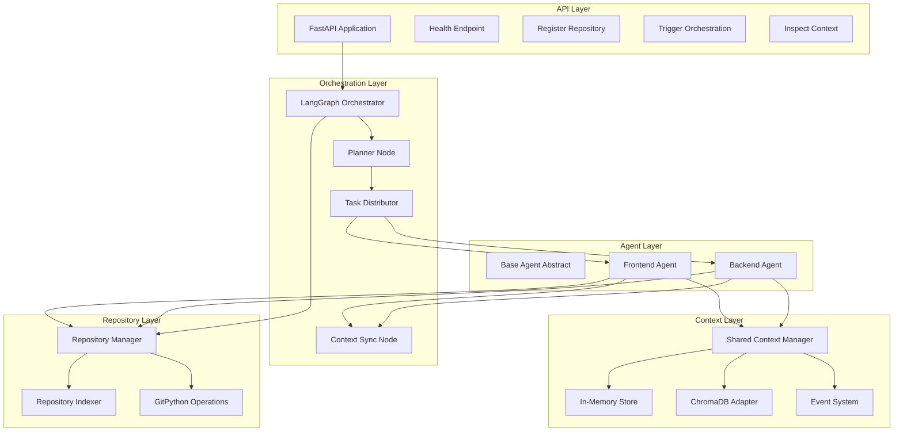

# RepoMesh AI - Phase 1 Architecture Plan

## Overview
RepoMesh AI is a multi-agent AI orchestration platform that coordinates development across multiple repositories using shared context. This document outlines the Phase 1 foundation architecture.

## System Architecture



## Core Components

### 1. API Layer (FastAPI)
**Purpose**: HTTP interface for external interactions

**Endpoints**:
- `GET /health` - Health check
- `POST /api/v1/repos/register` - Register repository
- `POST /api/v1/orchestrate` - Trigger orchestration
- `GET /api/v1/context` - Inspect shared context

**Features**:
- Async request handling
- Pydantic validation
- Dependency injection
- CORS support
- Structured error handling

### 2. Orchestration Layer (LangGraph)
**Purpose**: Coordinate multi-agent workflows

**Workflow**:
```
START → Planner → Task Distributor → [Frontend Agent || Backend Agent] → Context Sync → END
```

**State Management**:
- Orchestration state (tasks, dependencies, status)
- Parallel execution support
- Shared memory integration
- Event propagation

### 3. Agent System
**Purpose**: Execute repository-specific tasks

**Base Agent**:
- Abstract interface
- Context access methods
- Event publishing
- Task processing

**Specialized Agents**:
- **Frontend Agent**: Handles frontend repos (React, Vue, Svelte)
- **Backend Agent**: Handles backend repos (Python, Node, Go)

**Agent Capabilities**:
- Receive repo-specific context
- Access shared memory
- Publish events
- Process assigned tasks
- Coordinate via shared context

### 4. Shared Context Manager
**Purpose**: Cross-repository coordination memory

**Storage Types**:
- Architecture notes
- API contracts
- Schema changes
- Task events
- Repository metadata

**Adapter Pattern**:
```python
class ContextStore(ABC):
    @abstractmethod
    async def store(self, key: str, value: Any) -> None: ...
    
    @abstractmethod
    async def retrieve(self, key: str) -> Any: ...
    
    @abstractmethod
    async def search(self, query: str) -> List[Any]: ...

class InMemoryStore(ContextStore): ...
class ChromaDBStore(ContextStore): ...
```

### 5. Repository Manager
**Purpose**: Repository operations and metadata

**Capabilities**:
- Clone repositories (GitPython)
- Load local repositories
- Scan file structures
- Generate summaries
- Store metadata

**Metadata Structure**:
```python
class RepoMetadata(BaseModel):
    repo_id: str
    name: str
    type: RepoType  # frontend, backend, empty
    path: Path
    files: List[FileInfo]
    summary: str
    dependencies: List[str]
    tech_stack: List[str]
```

### 6. Event System
**Purpose**: Internal agent communication

**Event Types**:
- API updates
- Schema changes
- Task completion
- Dependency notifications

**Architecture**:
```python
class EventBus:
    async def publish(self, event: Event) -> None: ...
    async def subscribe(self, event_type: str, handler: Callable) -> None: ...
    async def unsubscribe(self, event_type: str, handler: Callable) -> None: ...
```

### 7. Repository Indexer
**Purpose**: Analyze and index repository contents

**Features**:
- Recursive file scanning
- Code file detection
- Lightweight summaries
- Embedding-ready chunking
- Metadata extraction

## Data Models

### Orchestration State
```python
class OrchestrationState(TypedDict):
    repos: List[RepoMetadata]
    tasks: List[Task]
    dependencies: Dict[str, List[str]]
    shared_context: Dict[str, Any]
    events: List[Event]
    status: OrchestrationStatus
```

### Task Definition
```python
class Task(BaseModel):
    task_id: str
    repo_id: str
    agent_type: AgentType
    description: str
    dependencies: List[str]
    status: TaskStatus
    context: Dict[str, Any]
```

### Event Schema
```python
class Event(BaseModel):
    event_id: str
    event_type: EventType
    source: str
    timestamp: datetime
    payload: Dict[str, Any]
```

## Directory Structure

```
repomesh-ai/
├── src/
│   ├── api/                    # FastAPI application
│   │   ├── __init__.py
│   │   ├── main.py            # App initialization
│   │   ├── routes/            # API endpoints
│   │   ├── dependencies.py    # DI providers
│   │   └── middleware.py      # CORS, logging
│   ├── orchestrator/          # LangGraph orchestration
│   │   ├── __init__.py
│   │   ├── graph.py           # State graph definition
│   │   ├── nodes.py           # Graph nodes
│   │   └── state.py           # State management
│   ├── agents/                # Agent implementations
│   │   ├── __init__.py
│   │   ├── base.py            # BaseAgent abstract
│   │   ├── frontend.py        # FrontendAgent
│   │   └── backend.py         # BackendAgent
│   ├── context/               # Shared context system
│   │   ├── __init__.py
│   │   ├── manager.py         # SharedContextManager
│   │   ├── stores/            # Storage adapters
│   │   │   ├── base.py
│   │   │   ├── memory.py
│   │   │   └── chromadb.py
│   │   └── events.py          # Event system
│   ├── repos/                 # Repository management
│   │   ├── __init__.py
│   │   ├── manager.py         # RepoManager
│   │   └── indexer.py         # Repository indexer
│   ├── core/                  # Core utilities
│   │   ├── __init__.py
│   │   ├── config.py          # Configuration
│   │   ├── logging.py         # Structured logging
│   │   └── models.py          # Pydantic models
│   └── utils/                 # Helper functions
│       ├── __init__.py
│       ├── file_utils.py
│       └── llm_utils.py
├── tests/                     # Test suite
│   ├── unit/
│   ├── integration/
│   └── fixtures/
├── examples/                  # Example scripts
│   ├── register_repos.py
│   └── run_orchestration.py
├── docs/                      # Documentation
│   ├── api.md
│   └── setup.md
├── pyproject.toml            # Project config
├── requirements.txt          # Dependencies
├── .env.example              # Environment template
├── .gitignore
└── README.md
```

## Technology Stack

### Core Dependencies
- **FastAPI**: Async web framework
- **LangGraph**: Agent orchestration
- **GitPython**: Git operations
- **Pydantic**: Data validation
- **OpenAI**: LLM provider
- **ChromaDB**: Vector store (optional)
- **Rich**: Console output
- **Python 3.11+**: Runtime

### Development Dependencies
- **pytest**: Testing framework
- **black**: Code formatting
- **ruff**: Linting
- **mypy**: Type checking

## Key Design Principles

### 1. Modularity
- Clear separation of concerns
- Independent component testing
- Easy component replacement

### 2. Extensibility
- Plugin architecture for agents
- Adapter pattern for storage
- Event-driven communication

### 3. Observability
- Structured logging
- Execution tracing
- Graph visualization
- Agent activity logs

### 4. Clean Abstractions
- Interface-based design
- Dependency injection
- Configuration management
- Type safety

### 5. Scalability
- Async operations
- Parallel execution
- Stateless agents
- Distributed-ready design

## What's NOT in Phase 1

To maintain focus on the MVP foundation:

- ❌ Full autonomous coding
- ❌ Pull request generation
- ❌ Advanced vector retrieval
- ❌ Frontend UI
- ❌ Authentication/Authorization
- ❌ Kubernetes deployment
- ❌ Redis/Kafka integration
- ❌ Advanced error recovery
- ❌ Multi-tenancy
- ❌ Real-time WebSocket updates

## Success Criteria

Phase 1 is complete when:

1. ✅ Multiple repositories can be registered
2. ✅ Orchestration workflow executes successfully
3. ✅ Agents coordinate via shared context
4. ✅ Events propagate between agents
5. ✅ Repository indexing works correctly
6. ✅ API endpoints respond properly
7. ✅ Logging provides clear visibility
8. ✅ Code is clean, documented, and testable

## Next Steps (Phase 2+)

- Advanced LLM-powered code generation
- Pull request automation
- Vector similarity search
- SvelteKit frontend
- Real-time collaboration
- Distributed execution
- Production deployment

---

**Version**: 1.0  
**Last Updated**: 2026-05-16  
**Status**: Planning Phase