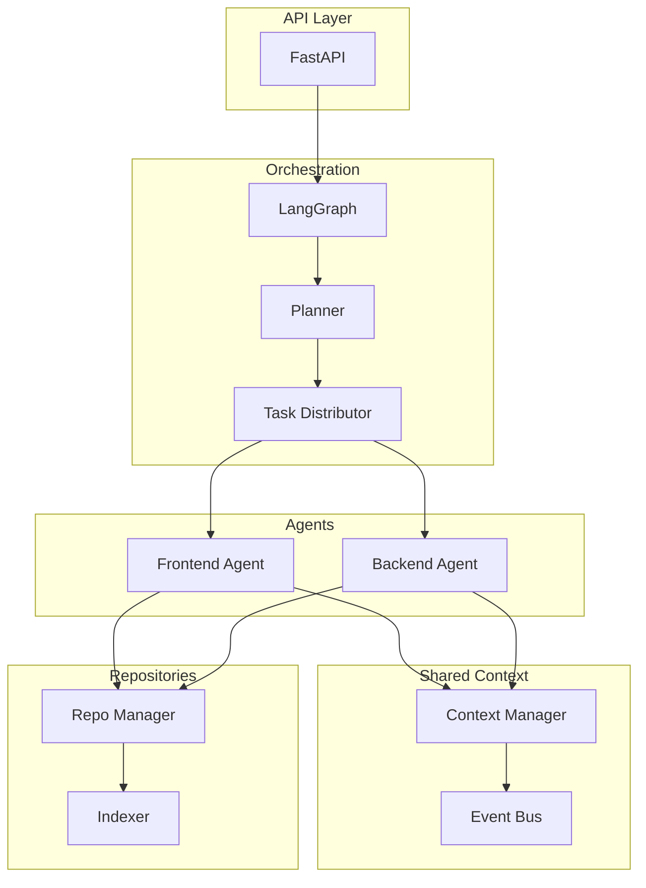

# RepoMesh AI 🤖

> Multi-agent AI orchestration platform for coordinating development across multiple repositories using shared context

[](https://www.python.org/downloads/)
[](https://fastapi.tiangolo.com/)
[](https://github.com/langchain-ai/langgraph)
[](https://opensource.org/licenses/MIT)

## 🎯 Overview

RepoMesh AI is a hackathon MVP that demonstrates how multiple AI agents can coordinate development activities across different repositories using a shared memory architecture. The platform uses LangGraph for orchestration, FastAPI for the API layer, and intelligent agents that communicate through shared context and events.

### Key Features

- 🔄 **Multi-Agent Orchestration**: Coordinate multiple specialized agents (Frontend, Backend) using LangGraph
- 🧠 **Shared Context Memory**: Agents share architecture notes, API contracts, and schema changes
- 📡 **Event-Driven Communication**: Internal event bus for real-time agent coordination
- 🗂️ **Repository Management**: Clone, index, and analyze multiple repositories
- 🔌 **Extensible Architecture**: Plugin-based agents, adapter pattern for storage
- 📊 **Observable Execution**: Structured logging with execution tracing
- ⚡ **Async-First Design**: Built on FastAPI and asyncio for high performance

## 🏗️ Architecture



## 🚀 Quick Start

### Prerequisites

- Python 3.11 or higher
- Git 2.30+
- OpenAI API key

### Installation

1. **Clone the repository**
```bash
git clone https://github.com/yourusername/repomesh-ai.git
cd repomesh-ai
```

2. **Create virtual environment**
```bash
python -m venv venv
source venv/bin/activate  # On Windows: venv\Scripts\activate
```

3. **Install dependencies**
```bash
pip install -r requirements.txt
```

4. **Configure environment**
```bash
cp .env.example .env
# Edit .env and add your OpenAI API key
```

5. **Run the application**
```bash
uvicorn src.api.main:app --reload
```

The API will be available at `http://localhost:8000`

### API Documentation

Once running, visit:
- **Interactive API docs**: http://localhost:8000/docs
- **Alternative docs**: http://localhost:8000/redoc

## 📖 Usage Examples

### Register Repositories

```python
import httpx
import asyncio

async def register_repos():
    async with httpx.AsyncClient() as client:
        # Register a local repository
        response = await client.post(
            "http://localhost:8000/api/v1/repos/register",
            json={
                "local_path": "/path/to/frontend-repo",
            }
        )
        frontend_repo = response.json()
        
        # Register a remote repository
        response = await client.post(
            "http://localhost:8000/api/v1/repos/register",
            json={
                "remote_url": "https://github.com/user/backend-repo.git",
                "dest_path": "./repos/backend-repo"
            }
        )
        backend_repo = response.json()
        
        return frontend_repo, backend_repo

asyncio.run(register_repos())
```

### Trigger Orchestration

```python
async def run_orchestration(repo_ids):
    async with httpx.AsyncClient() as client:
        response = await client.post(
            "http://localhost:8000/api/v1/orchestrate",
            json={
                "repo_ids": repo_ids,
                "task_description": "Analyze API contracts and ensure consistency",
                "options": {
                    "parallel_execution": True
                }
            }
        )
        result = response.json()
        print(f"Orchestration started: {result['orchestration_id']}")
        return result

# Run with registered repo IDs
asyncio.run(run_orchestration(["repo-id-1", "repo-id-2"]))
```

### Inspect Shared Context

```python
async def inspect_context():
    async with httpx.AsyncClient() as client:
        response = await client.get(
            "http://localhost:8000/api/v1/context",
            params={"query": "api contracts"}
        )
        context = response.json()
        print(f"Found {len(context['results'])} context items")
        return context

asyncio.run(inspect_context())
```

## 🧩 Core Components

### 1. Repository Manager
Handles repository operations using GitPython:
- Clone remote repositories
- Load local repositories
- Scan file structures
- Generate metadata and summaries

### 2. Shared Context Manager
Manages cross-repository coordination:
- Store architecture notes
- Track API contracts
- Monitor schema changes
- Enable agent communication

**Storage Adapters**:
- **In-Memory**: Fast, no persistence (default)
- **ChromaDB**: Vector search, persistent storage

### 3. Agent System
Specialized agents for different repository types:

**Frontend Agent**:
- Component analysis
- API integration detection
- UI pattern recognition
- Dependency tracking

**Backend Agent**:
- API endpoint analysis
- Schema tracking
- Service dependency mapping
- Endpoint documentation

### 4. LangGraph Orchestration
Workflow execution engine:
```
START → Planner → Task Distributor → [Frontend || Backend] → Context Sync → END
```

### 5. Event System
Internal event bus for agent communication:
- API updates
- Schema changes
- Task completion
- Dependency notifications

## 📁 Project Structure

```
repomesh-ai/
├── src/
│   ├── api/                    # FastAPI application
│   │   ├── main.py            # App initialization
│   │   ├── routes/            # API endpoints
│   │   ├── dependencies.py    # DI providers
│   │   └── middleware.py      # Middleware
│   ├── orchestrator/          # LangGraph orchestration
│   │   ├── graph.py           # State graph
│   │   ├── nodes.py           # Graph nodes
│   │   └── state.py           # State management
│   ├── agents/                # Agent implementations
│   │   ├── base.py            # BaseAgent
│   │   ├── frontend.py        # FrontendAgent
│   │   └── backend.py         # BackendAgent
│   ├── context/               # Shared context system
│   │   ├── manager.py         # Context manager
│   │   ├── stores/            # Storage adapters
│   │   └── events.py          # Event system
│   ├── repos/                 # Repository management
│   │   ├── manager.py         # RepoManager
│   │   ├── indexer.py         # Indexer
│   │   └── scanner.py         # File scanner
│   ├── core/                  # Core utilities
│   │   ├── config.py          # Configuration
│   │   ├── logging.py         # Logging setup
│   │   └── models.py          # Pydantic models
│   └── utils/                 # Helper utilities
├── tests/                     # Test suite
├── examples/                  # Example scripts
├── docs/                      # Documentation
├── pyproject.toml            # Project config
├── requirements.txt          # Dependencies
└── README.md                 # This file
```

## 🔧 Configuration

Configuration is managed through environment variables and `.env` file:

```bash
# API Settings
API_HOST=0.0.0.0
API_PORT=8000

# OpenAI Settings
OPENAI_API_KEY=your-api-key-here
OPENAI_MODEL=gpt-4
OPENAI_TEMPERATURE=0.7

# Storage Settings
STORAGE_TYPE=memory  # or "chromadb"
CHROMADB_PERSIST_DIR=./chroma_db

# Repository Settings
REPOS_BASE_DIR=./repos
MAX_REPO_SIZE_MB=500

# Orchestration Settings
MAX_PARALLEL_AGENTS=5
MAX_ITERATIONS=10
TASK_TIMEOUT_SECONDS=300

# Logging Settings
LOG_LEVEL=INFO
LOG_FORMAT=json
USE_RICH_LOGGING=true
```

## 🧪 Testing

Run the test suite:

```bash
# Run all tests
pytest

# Run with coverage
pytest --cov=src --cov-report=html

# Run specific test file
pytest tests/unit/test_agents.py

# Run integration tests
pytest tests/integration/
```

## 📚 Documentation

- **[Architecture Guide](ARCHITECTURE.md)**: System architecture and design decisions
- **[Implementation Plan](IMPLEMENTATION_PLAN.md)**: Detailed implementation roadmap
- **[Technical Specification](TECHNICAL_SPEC.md)**: Complete technical specifications
- **[API Documentation](docs/api.md)**: API endpoint reference
- **[Setup Guide](docs/setup.md)**: Detailed setup instructions
- **[Development Guide](docs/development.md)**: Development workflow and guidelines

## 🎯 Phase 1 Scope

This is a **hackathon MVP** focused on foundational infrastructure:

### ✅ Included
- Multi-repository registration and indexing
- LangGraph orchestration workflow
- Specialized agents (Frontend, Backend)
- Shared context memory system
- Event-driven agent communication
- FastAPI REST API
- Structured logging and tracing

### ❌ Not Included (Future Phases)
- Full autonomous coding
- Pull request generation
- Advanced vector retrieval
- Frontend UI (SvelteKit)
- Authentication/Authorization
- Kubernetes deployment
- Redis/Kafka integration
- Real-time WebSocket updates

## 🛣️ Roadmap

### Phase 2: Advanced Features
- LLM-powered code generation
- Pull request automation
- Advanced vector similarity search
- Code quality analysis

### Phase 3: Frontend
- SvelteKit web interface
- Real-time collaboration
- Workflow visualization
- Interactive debugging

### Phase 4: Production
- Authentication and authorization
- Distributed execution
- Kubernetes deployment
- Monitoring and alerting

## 🤝 Contributing

Contributions are welcome! Please read our [Contributing Guidelines](CONTRIBUTING.md) first.

1. Fork the repository
2. Create a feature branch (`git checkout -b feature/amazing-feature`)
3. Commit your changes (`git commit -m 'Add amazing feature'`)
4. Push to the branch (`git push origin feature/amazing-feature`)
5. Open a Pull Request

## 📝 License

This project is licensed under the MIT License - see the [LICENSE](LICENSE) file for details.

## 🙏 Acknowledgments

- **LangGraph**: For the powerful orchestration framework
- **FastAPI**: For the excellent async web framework
- **OpenAI**: For GPT-4 API access
- **ChromaDB**: For vector storage capabilities

## 📧 Contact

- **Project Lead**: Your Name
- **Email**: your.email@example.com
- **GitHub**: [@yourusername](https://github.com/yourusername)

## 🌟 Star History

If you find this project useful, please consider giving it a star! ⭐

---

**Built with ❤️ for the AI Hackathon 2026**