# RepoMesh AI - Workflow Guide

## Overview

This guide provides detailed visualizations and explanations of how RepoMesh AI orchestrates multi-agent workflows across repositories.

## Complete System Workflow

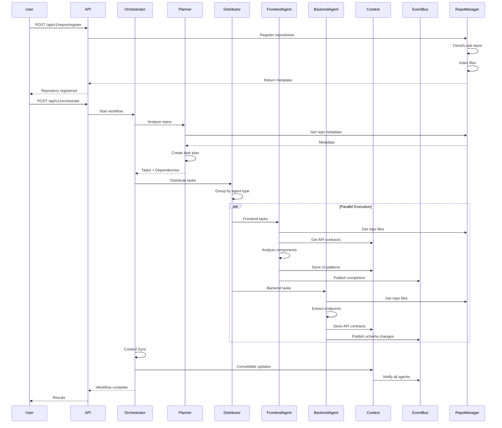

## Detailed Component Workflows

### 1. Repository Registration Flow

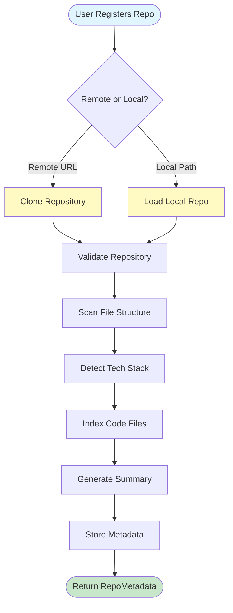

**Steps Explained**:

1. **Input Validation**: Check if remote URL or local path provided
2. **Repository Access**: Clone from Git or load from filesystem
3. **Validation**: Verify repository structure and accessibility
4. **File Scanning**: Recursively scan all files and directories
5. **Tech Stack Detection**: Identify languages and frameworks
6. **Code Indexing**: Extract code files and prepare for analysis
7. **Summary Generation**: Create lightweight repository summary
8. **Metadata Storage**: Store all information for future access

### 2. Orchestration Workflow

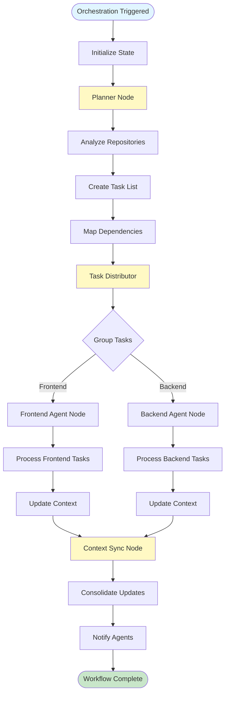

**Node Responsibilities**:

#### Planner Node
- Analyzes all registered repositories
- Identifies cross-repository dependencies
- Creates prioritized task list
- Assigns tasks to appropriate agents

#### Task Distributor Node
- Groups tasks by agent type
- Checks task dependencies
- Enables parallel execution
- Routes to agent nodes

#### Agent Nodes (Frontend/Backend)
- Process assigned tasks
- Access shared context
- Analyze repository code
- Generate insights
- Publish updates

#### Context Sync Node
- Collects all context updates
- Resolves conflicts
- Updates shared memory
- Notifies all agents

### 3. Agent Task Processing

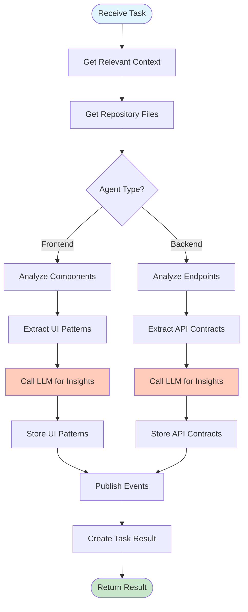

### 4. Shared Context Flow

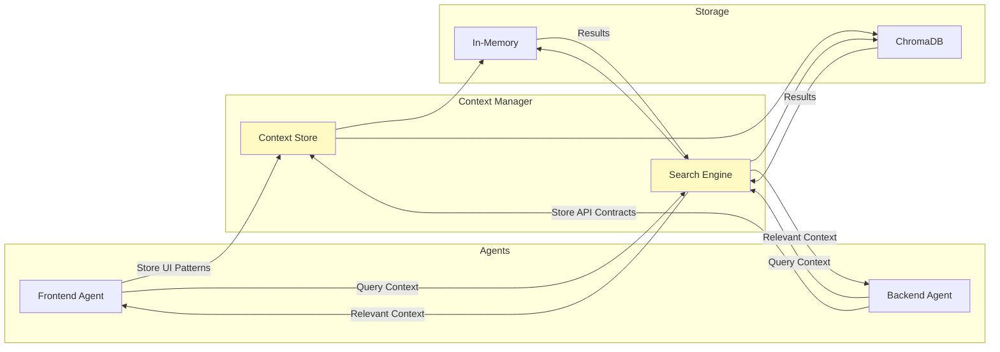

### 5. Event System Flow

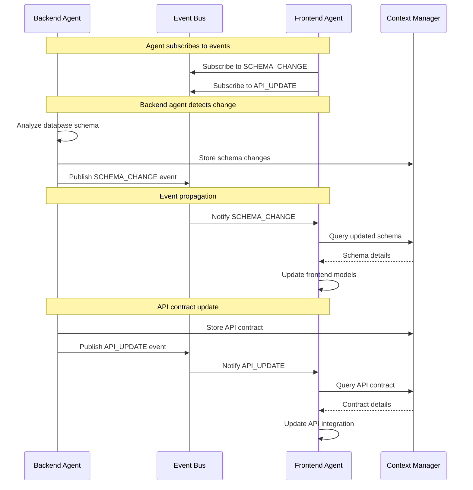

## State Management

### Orchestration State Structure

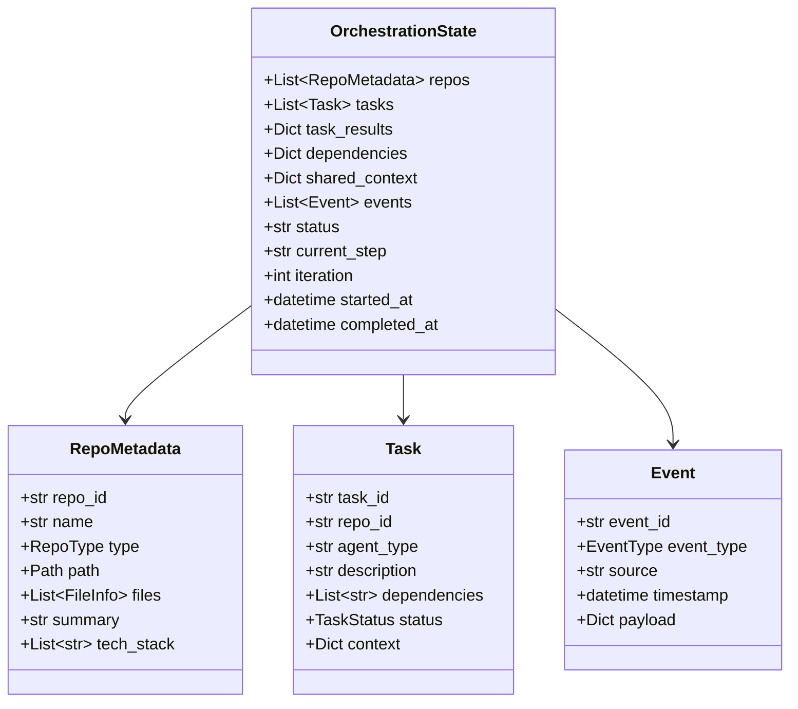

## Execution Examples

### Example 1: Single Frontend Repository

```mermaid
gantt
    title Frontend Repository Analysis
    dateFormat  HH:mm:ss
    axisFormat %H:%M:%S
    
    section Registration
    Register Repo           :done, reg, 00:00:00, 5s
    Index Files            :done, idx, after reg, 3s
    
    section Orchestration
    Initialize             :done, init, after idx, 1s
    Planner Node          :done, plan, after init, 2s
    Task Distributor      :done, dist, after plan, 1s
    
    section Agent Execution
    Frontend Agent        :active, fe, after dist, 10s
    Analyze Components    :active, comp, after dist, 4s
    Check API Integration :active, api, after comp, 3s
    Generate Insights     :active, ins, after api, 3s
    
    section Finalization
    Context Sync          :sync, after fe, 2s
    Complete              :crit, done, after sync, 1s
```

### Example 2: Frontend + Backend Coordination

```mermaid
gantt
    title Multi-Repository Orchestration
    dateFormat  HH:mm:ss
    axisFormat %H:%M:%S
    
    section Registration
    Register Frontend      :done, fe-reg, 00:00:00, 5s
    Register Backend       :done, be-reg, 00:00:00, 5s
    
    section Orchestration
    Initialize            :done, init, after be-reg, 1s
    Planner Node         :done, plan, after init, 3s
    Task Distributor     :done, dist, after plan, 1s
    
    section Parallel Execution
    Frontend Agent       :active, fe, after dist, 10s
    Backend Agent        :active, be, after dist, 12s
    
    section Context Sharing
    BE Publishes API     :crit, api, 00:00:15, 1s
    FE Receives API      :crit, recv, after api, 1s
    FE Updates Code      :active, upd, after recv, 3s
    
    section Finalization
    Context Sync         :sync, after be, 2s
    Complete             :crit, done, after sync, 1s
```

## Error Handling Flow

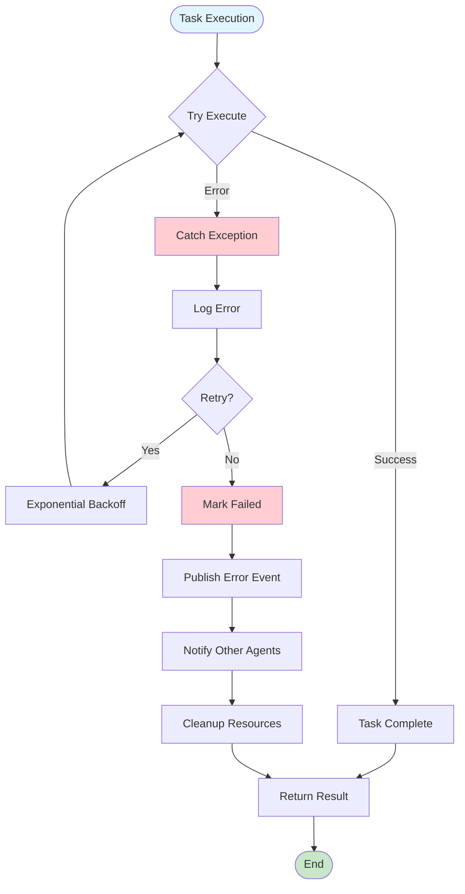

## Performance Optimization

### Parallel Execution Strategy

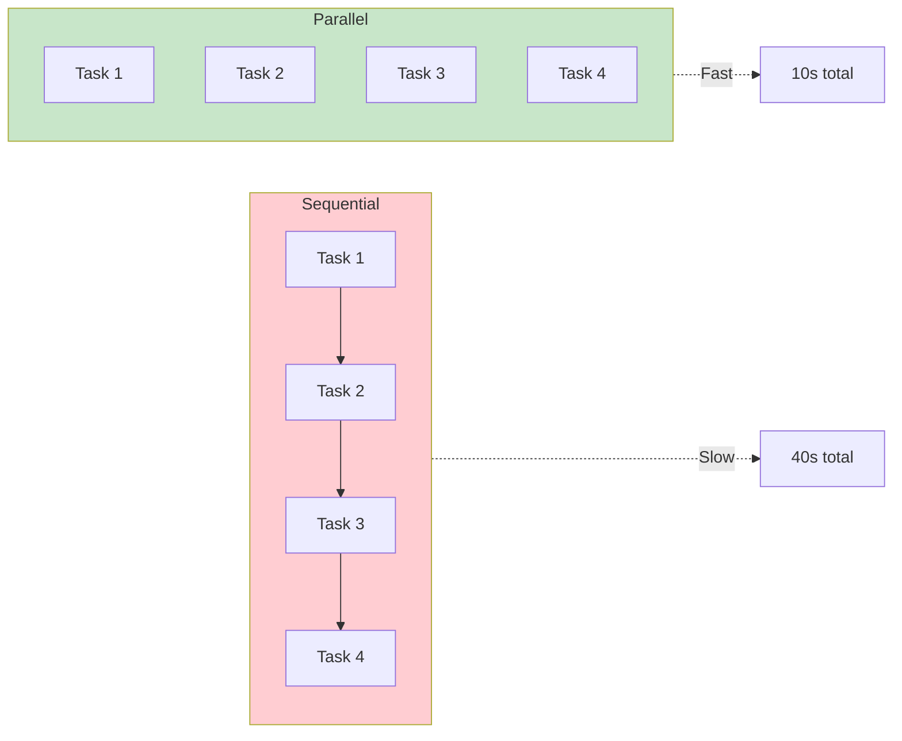

**Benefits**:
- 4x faster execution with 4 parallel tasks
- Better resource utilization
- Reduced total orchestration time

### Caching Strategy

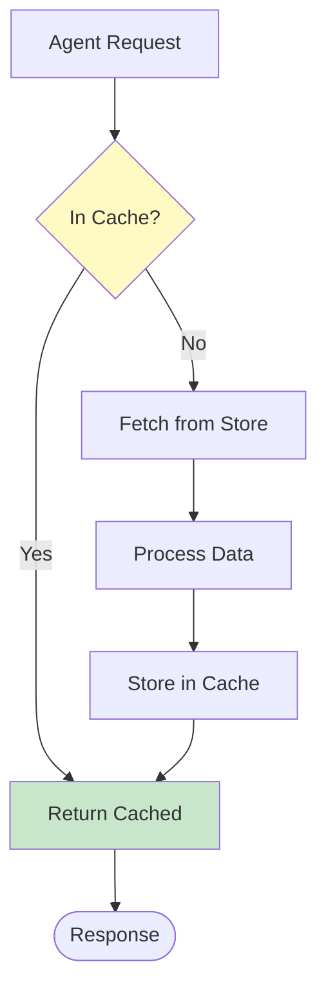

## Monitoring and Observability

### Execution Trace Example

```
[2026-05-16 03:20:00] [orchestrator] Starting orchestration workflow
[2026-05-16 03:20:01] [planner] Analyzing 2 repositories
[2026-05-16 03:20:02] [planner] Created 4 tasks with 2 dependencies
[2026-05-16 03:20:03] [distributor] Distributing tasks to agents
[2026-05-16 03:20:03] [frontend-agent] Processing task: analyze_frontend_repo
[2026-05-16 03:20:03] [backend-agent] Processing task: analyze_backend_repo
[2026-05-16 03:20:08] [backend-agent] Extracted 15 API endpoints
[2026-05-16 03:20:09] [backend-agent] Published API_UPDATE event
[2026-05-16 03:20:10] [frontend-agent] Received API_UPDATE event
[2026-05-16 03:20:12] [frontend-agent] Updated API integration
[2026-05-16 03:20:13] [context-sync] Synchronizing shared context
[2026-05-16 03:20:14] [orchestrator] Workflow completed successfully
```

## Best Practices

### 1. Task Design
- Keep tasks focused and single-purpose
- Define clear dependencies
- Enable parallel execution where possible
- Include timeout limits

### 2. Context Management
- Store only essential information
- Use descriptive keys
- Include metadata for filtering
- Clean up stale context

### 3. Event Handling
- Subscribe only to relevant events
- Handle events asynchronously
- Include error handling
- Log all event activity

### 4. Agent Implementation
- Implement idempotent operations
- Use structured logging
- Handle partial failures gracefully
- Publish progress updates

## Troubleshooting Guide

### Common Issues

**Issue**: Orchestration hangs
- **Cause**: Circular dependencies
- **Solution**: Review task dependencies, ensure DAG structure

**Issue**: Context not shared
- **Cause**: Event not published
- **Solution**: Verify event publishing in agent code

**Issue**: Agent timeout
- **Cause**: LLM call too slow
- **Solution**: Increase timeout or optimize prompt

**Issue**: Memory usage high
- **Cause**: Large context store
- **Solution**: Implement cleanup policy, use ChromaDB

---

**Version**: 1.0  
**Last Updated**: 2026-05-16  
**Status**: Complete